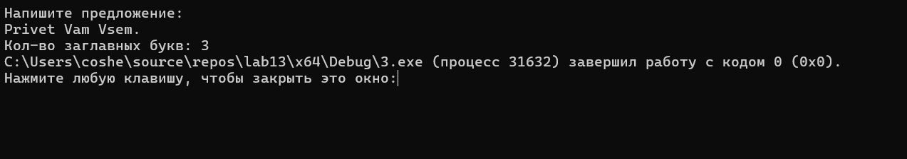

# Домашнее задание к работе 13
## Условие задачи
определяет число слов в нем, написанных с большой буквы.

### Блок-схема

## 2. Реализация программы:
    #define _CRT_SECURE_NO_WARNINGS
    #define _USE_MATH_DEFINES
    #include <locale.h>
    #include <stdio.h>
    #include <stdlib.h>
    #include <string.h> 
    #include <conio.h>
    #include <math.h>
    int main() {
        setlocale(LC_ALL, "RUS");
        printf("Напишите предложение:\n");
        char str[200];
        fgets(str, sizeof(str), stdin);
        int k = 0;
        int inWord = 0;  
        for (int i = 0; str[i] != '\0'; i++) {
            if (!isspace((unsigned char)str[i])) {
                if (!inWord) {                    
                    inWord = 1;
                    if (isupper((unsigned char)str[i])) {
                        k++;  
                    }
                }
            }
            else {
                inWord = 0; 
            }
        }
        printf("Кол-во заглавных букв: %d", k);
       
    }
## 3. Результат работы программы

## 4. Информация о разработчике
Амелина Юлия, бИПТ-252
